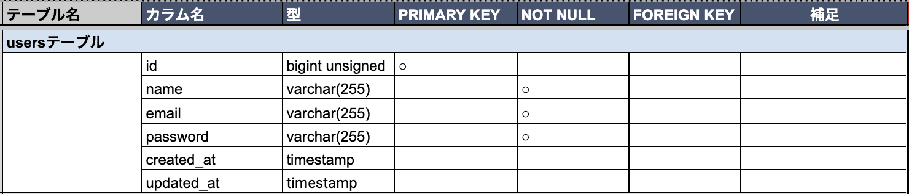
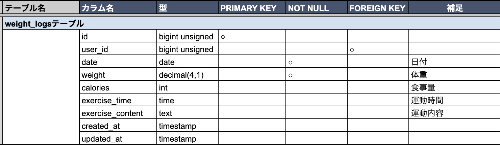
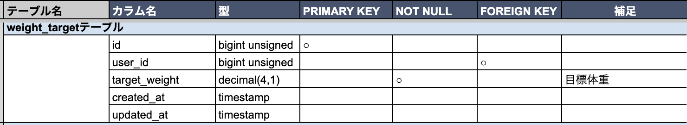

# Pigry

## 環境構築
**Dockerビルド**
1. git clone git@github.com:pekotarou/review-test3.git
2. cd review-test3
3. DockerDesktopアプリを立ち上げる
4. `docker-compose up -d --build`

> *MacのM1・M2チップのPCの場合、`no matching manifest for linux/arm64/v8 in the manifest list entries`のメッセージが表示されビルドができないことがあります。
エラーが発生する場合は、docker-compose.ymlファイルの「mysql」内に「platform」の項目を追加で記載してください*
``` bash
mysql:
    platform: linux/x86_64(この文追加)
    image: mysql:8.0.26
    environment:
```

**Laravel環境構築**
1. `docker-compose exec php bash`
2. `composer install`
3. 「.env.example」ファイルを 「.env」ファイルに命名を変更。または、新しく.envファイルを作成
4. .envに以下の環境変数を追加
``` text
DB_CONNECTION=mysql
DB_HOST=mysql
DB_PORT=3306
DB_DATABASE=laravel_db
DB_USERNAME=laravel_user
DB_PASSWORD=laravel_pass
```
5. アプリケーションキーの作成
``` bash
php artisan key:generate
```

6. マイグレーションの実行
``` bash
php artisan migrate
```

7. シーディングの実行
``` bash
php artisan db:seed
```

## 使用技術(実行環境)
- PHP8.5.0
- Laravel8.83.8
- MySQL8.0.26

## テーブル設計





## ER図


## URL
- 開発環境：http://localhost/
- phpMyAdmin:：http://localhost:8080/

## ダミーデータについて
- user 1件（データ追加の記録35件、目標体重設定済み）
    メールアドレス： tony@gmail.com
    パスワード：　AmericanAmerican

## ログイン試行回数について
- src > app > providers > FortifyServiceProvider.php
    上記のpublic function boot()にて、ログイン試行回数を多く設定しています。不要であれば、以下の箇所をコメントアウト又は削除してください。
    ```
    //ログイン試行回数少し増やす
    RateLimiter::for('login', function (Request $request) {
        $email = (string) $request->email;

        return Limit::perMinute(10)->by($email . $request->ip());
    });
    ```

## アプリについて
- 体重や体重に関する項目（日にち、摂取カロリー、運動時間、運動内容）について、記録を残すことができるアプリです。
- 過去のデータを、日にちで検索することができます。

## 使い方
1. サイトにアクセス: http://localhost/register/step1
2. アカウント作成
3. ログインして、日々の体重や摂取カロリー、運動内容等を記録する